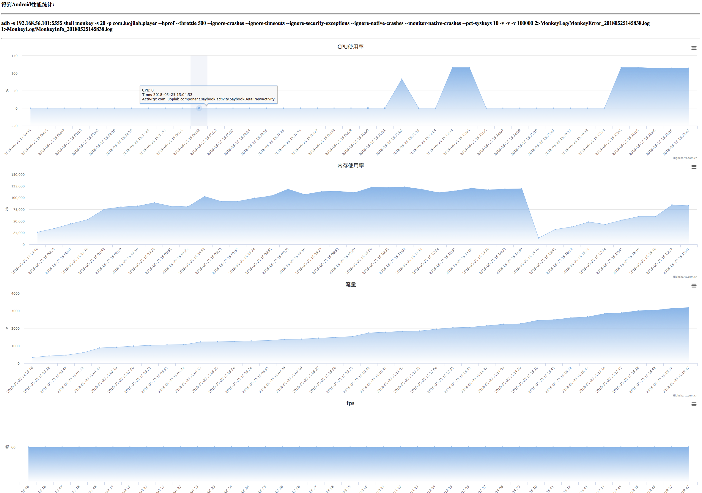

# 项目简介
基于原生google的monkey,增了加一些自定义功能

# 使用方式一

```angular2html
命令行传参数
python /Run.py 
--apkname=com.xxxx.xxxx 
--runtime=30 
--seed=20 --throttle=500
--simulator=True
--appdebug=False 
--apkpath=xxxxxx.apk
--devices=192.168.56.101:5555 
--whitelist=com.xxxx.xxxx.xxxxx 
--account=18513571170 
--pwd=123321 
--loglevel=DEBUG
```
# 使用方式二

```angular2html
配置Config.yml文件
python EasyRun.py 
```

# 支持功能
```
1.自定义运行时长
2.自动隐藏顶部导航栏
3.支持白名单
4.log级别自定义
5.生成性能报告并发送
6.发送崩溃日志邮件
7.monkey运行结果插入数据库
8.跳回app机制
9.自动开启wifi功能
```

# 邮件
需要在MailConfig.py中配置邮件邮箱和密码

# SQL
需要在SQLConfig.py中配置数据库用户和密码

# 性能报告
./ReportServer/performanceReport目录下

报告展示如下:



# 生成项目依赖并安装

```
运行Setup.py

1.pip install pipreqs
2.工程目录下：pipreqs ./
3.pip install -r requirements.txt
```